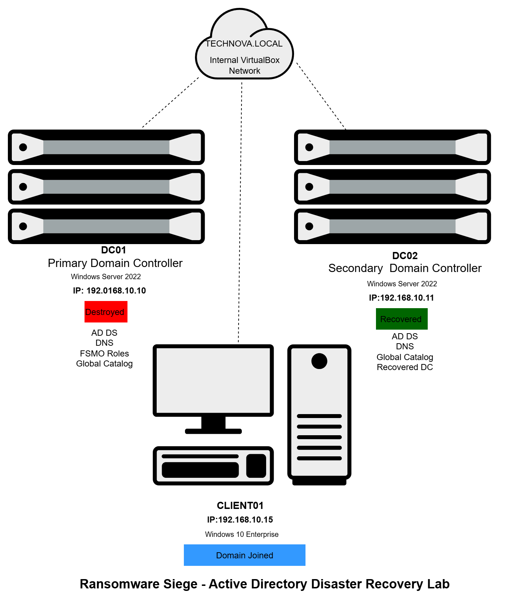
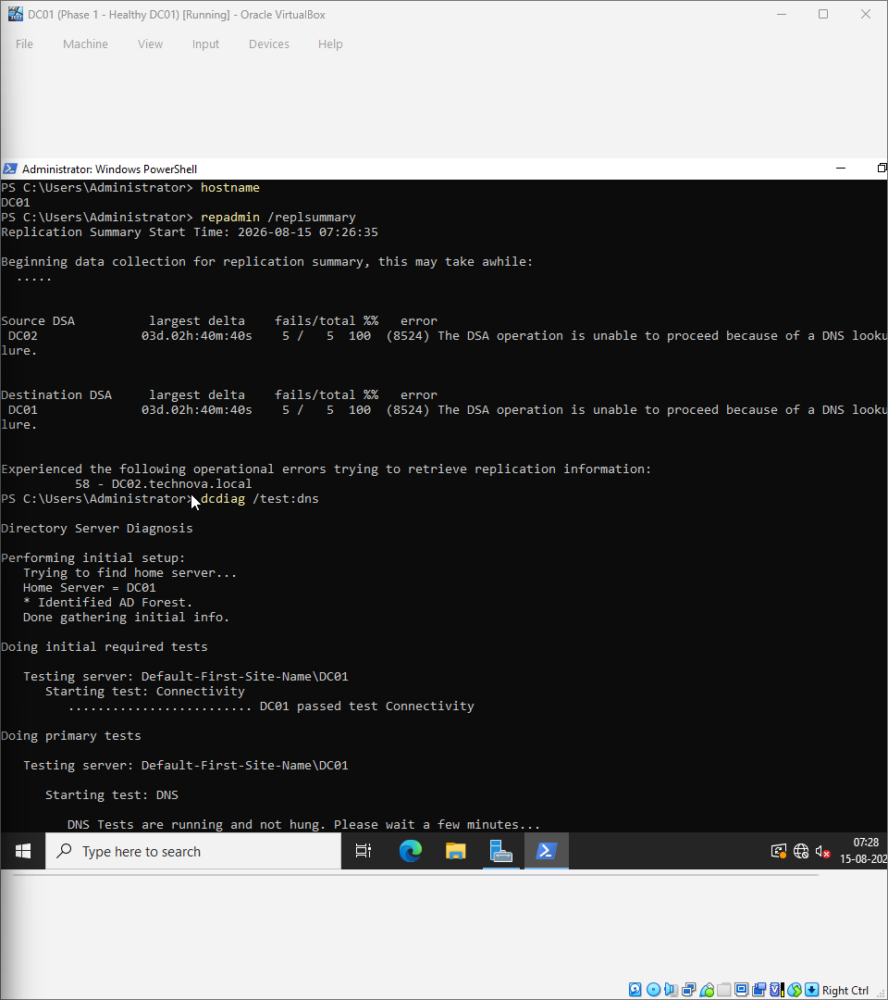
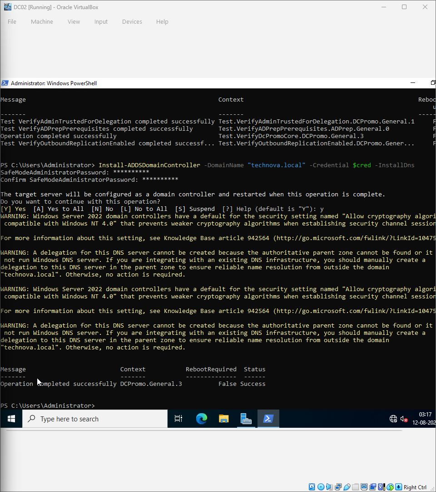
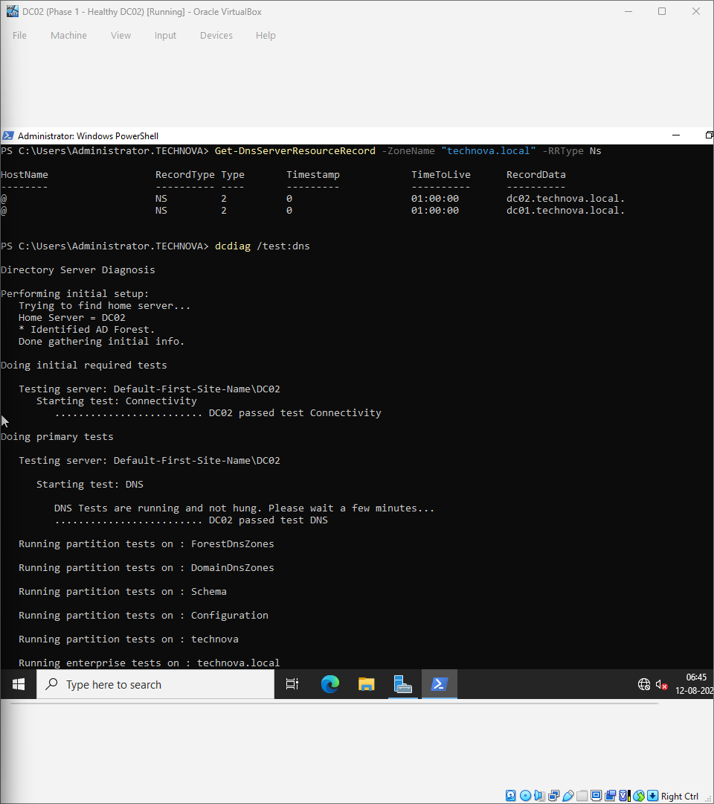
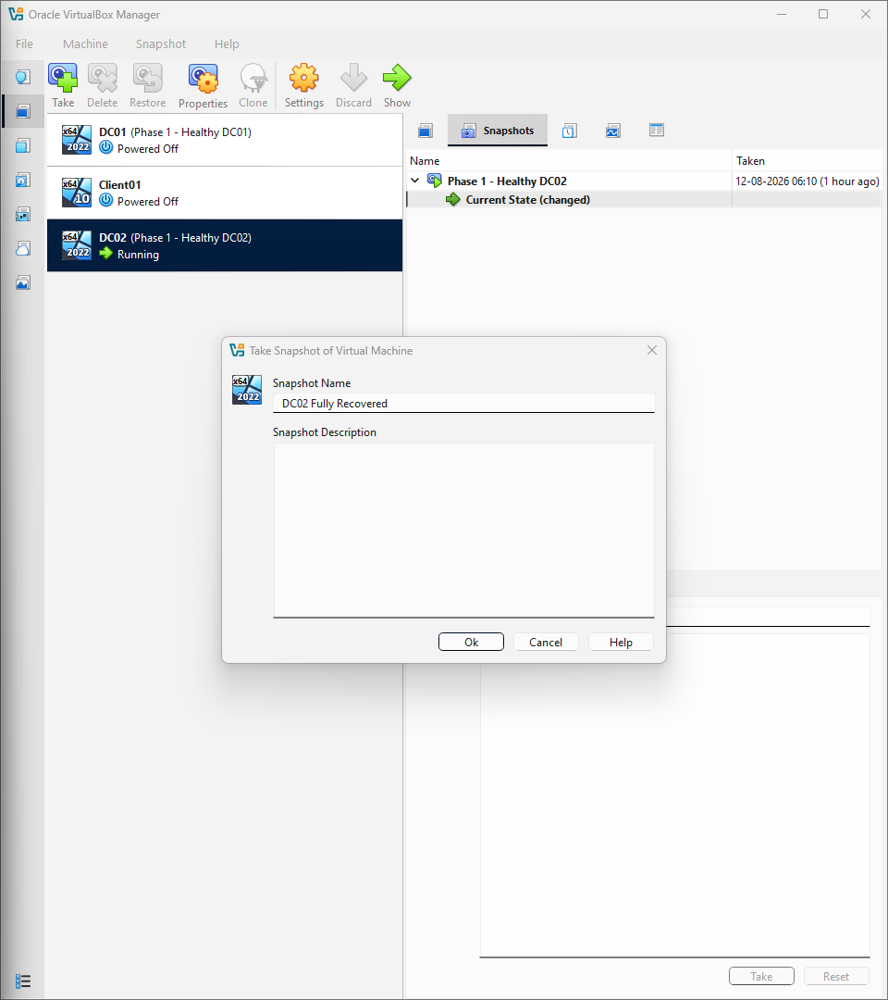
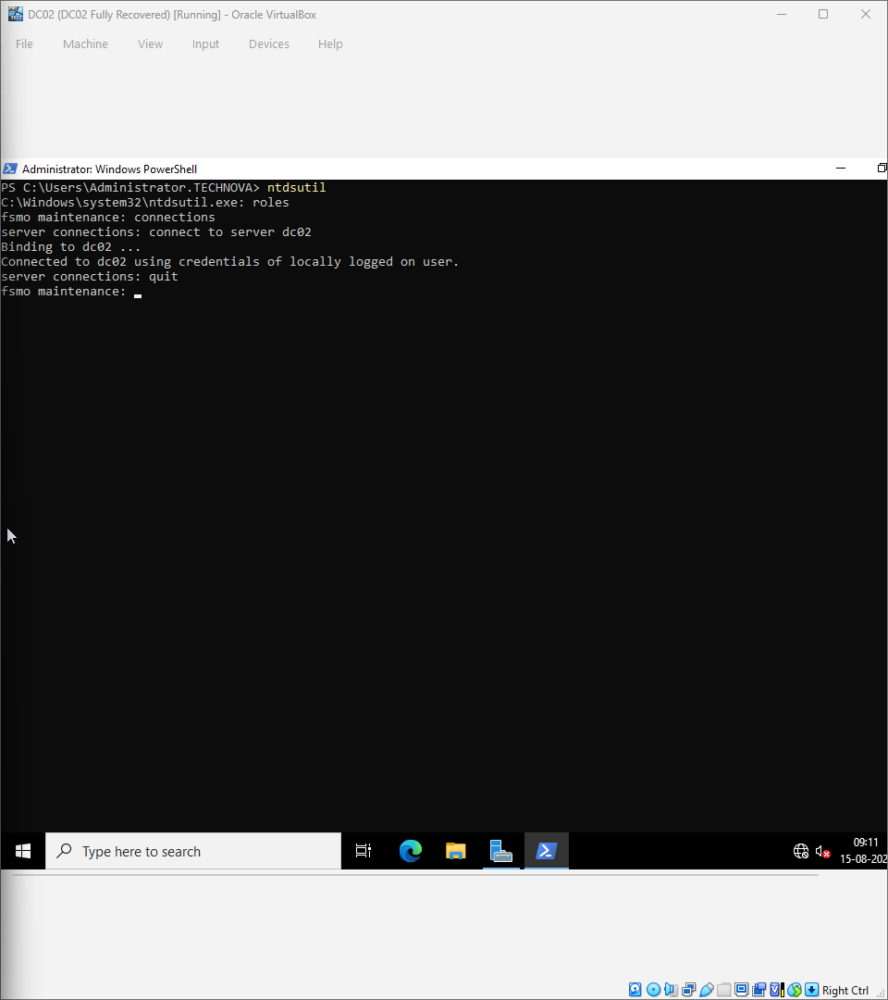
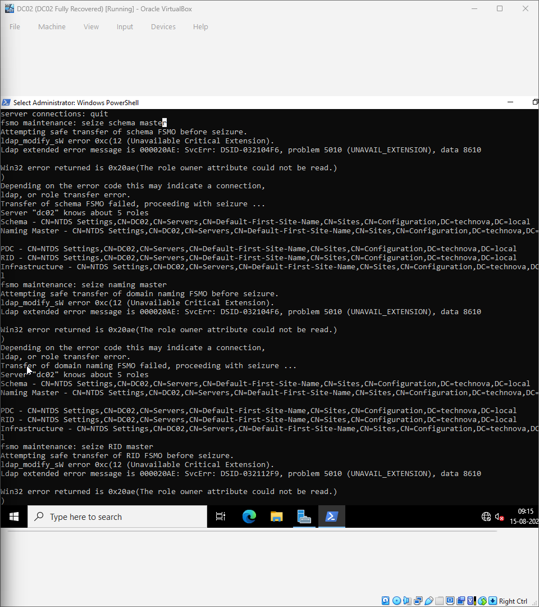
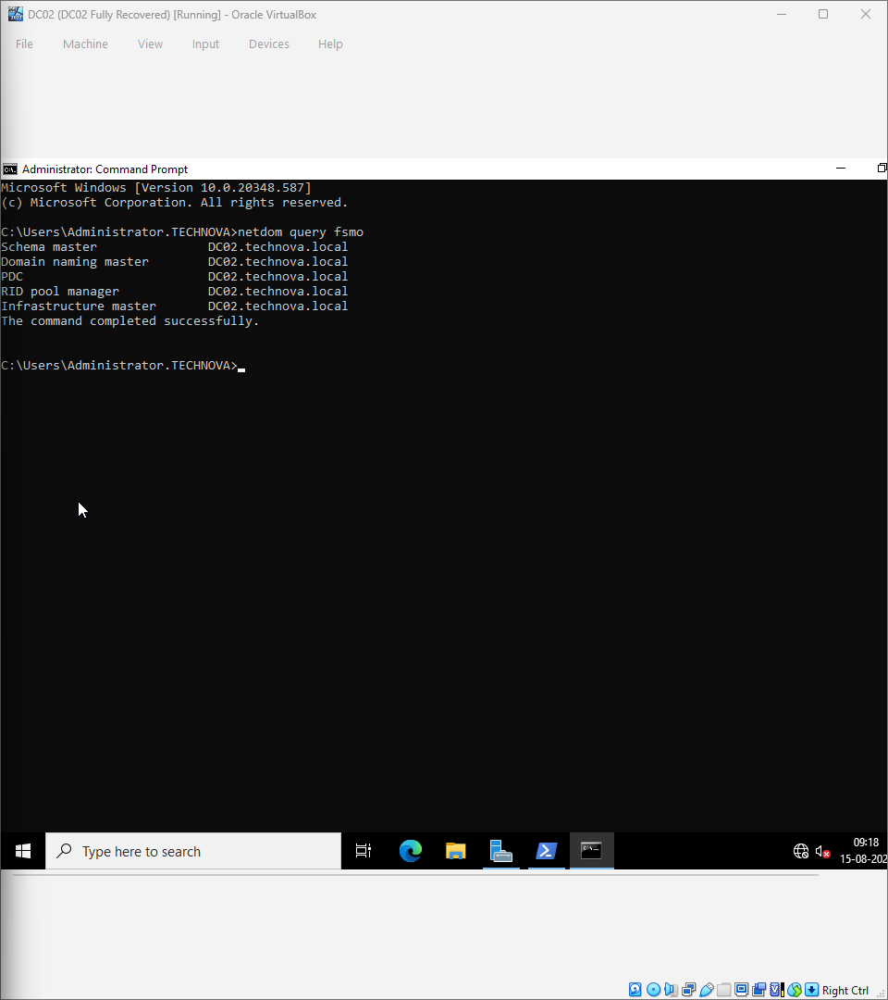
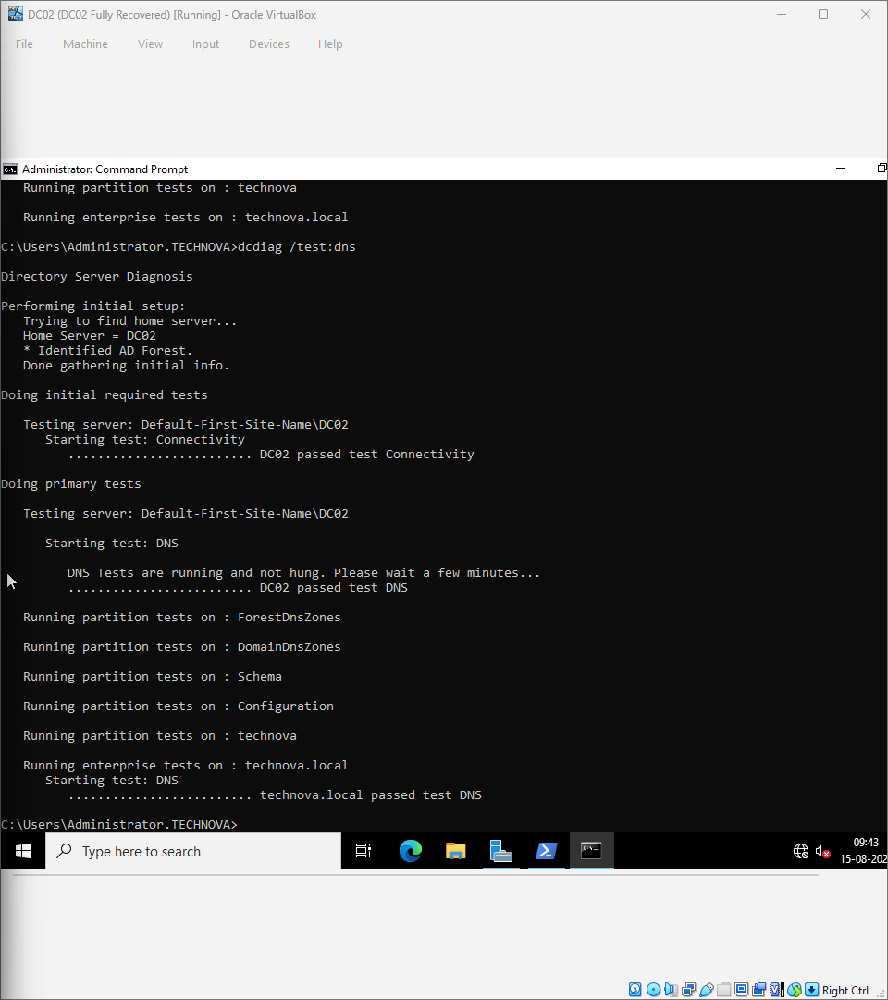

# Ransomware Siege – Active Directory Disaster Recovery Lab

## Project Overview

This project simulates an enterprise ransomware attack where the primary Domain Controller (DC01) is permanently lost. The Active Directory environment is recovered using a secondary Domain Controller (DC02) through disaster recovery procedures.

---

## Network Architecture

---

## Lab Environment

*Hypervisor:* Oracle VirtualBox

*Server OS:* Windows Server 2022

*Client OS:* Windows 10 Enterprise

*Domain:* technova.local

*Services:* Active Directory, DNS, Group Policy

*Tools:* PowerShell, NTDSUTIL, DCDIAG, REPADMIN

---

# Phase 1 – Initial Domain Health

The Active Directory environment was deployed with DC01 as the primary Domain Controller. DNS and replication were verified before introducing the disaster scenario.

---

# Phase 2 – Promote DC02

DC02 was promoted as an additional Domain Controller with integrated DNS to provide redundancy.

---

# Phase 3 – DNS Validation

After promotion, DNS records and Active Directory health were validated using DCDIAG.

---

# Phase 4 – Recovery Snapshot

A VirtualBox snapshot was created to preserve the healthy recovery state before performing critical recovery operations.

---

# Phase 5 – Connect for FSMO Recovery

NTDSUTIL was used to connect DC02 and prepare it for FSMO role recovery.

---

# Phase 6 – FSMO Role Seizure

All five FSMO roles were seized from the failed DC01 and assigned to DC02.

---

# Phase 7 – Verify FSMO Ownership

The transfer was confirmed successfully using `netdom query fsmo`. 

---

# Phase 8 – Final Health Check

A complete DNS diagnostic confirmed that the recovered domain was fully operational.

---

# Skills Demonstrated

- Active Directory Domain Services
- Windows Server 2022 Administration
- DNS Management
- Domain Controller Promotion
- FSMO Role Seizure
- NTDSUTIL Recovery
- DCDIAG Health Validation
- PowerShell Administration
- VirtualBox Disaster Recovery

---

# Project Outcome

- Recovered enterprise Active Directory after a simulated ransomware attack.
- Restored DNS and Global Catalog services.
- Successfully transferred all FSMO roles to DC02.
- Validated a healthy and operational domain environment.
